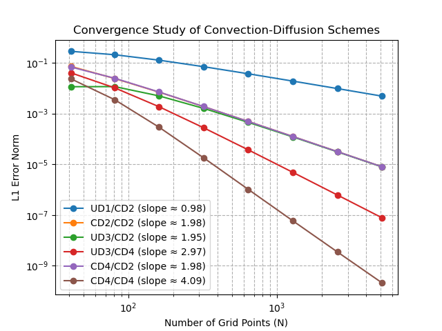

# 1D Convection-Diffusion Solver 

This repository contains a Python implementation of a **1D finite-difference solver** for the convection–diffusion equation. 
```math

\frac{d}{dx} \left( u \phi \right) = \frac{d}{dx} \left( \Gamma \frac{d\phi}{dx} \right)

```

Where:

- $$\( \phi(x) \)$$: scalar field (e.g., temperature, concentration)
- $$\( u \)$$: velocity (assumed constant)
- $$\( \Gamma \)$$: diffusion coefficient (can be constant or variable)


It includes multiple discretization schemes and supports **deferred correction** to improve accuracy.





## Features

- ✅ Multiple convection schemes:
  - First-order Upwind (UD1)
  - Central Difference (CD2)
  - Third-order Upwind (UD3)
  - Fourth-order Central Difference (CD4)
- ✅ Diffusion discretization:
  - Second-order Central Difference (CD2)
  - Fourth-order Central Difference (CD4)
- ✅ High-order **deferred correction** for both terms
- ✅ Efficient tridiagonal solver (TDMA)
- ✅ Automated convergence study & log-log error plot
- ✅ Output table with **observed convergence rates**


## Project Structure

.
├── fd1d.py           # Main solver and convergence logic
├── requirements.txt  # Python dependencies
├── ConvergenceRates.png
├── convergence_table.csv
├── .gitignore
└── README.md


##  Getting Started

### Create a virtual environment


```bash
python3 -m venv venv
source venv/bin/activate          #On Windows: venv\Scripts\activate
pip install -r requirements.txt
python ./fd1d.py 
```


This will:

* solve the convection–diffusion equation


* generate `convergenceRates.png`
* generate `convergence_table.csv`

## Sample Results
The solver estimates the order of convergence using least squares on log-log data. Example:

### Scheme Observed Order
UD1 / CD2	≈ 1
CD2 / CD2	≈ 2
UD3 / CD2	≈ 3
CD4 / CD2	≈ 4
CD4 / CD4	≈ 4

## Dependencies

```
numpy
matplotlib
pandas
```

## Notes
This solver is designed for testing and educational analysis of finite-difference discretizations of the convection–diffusion equation in 1D. This is inspired by Peric's Lectures on CFD.

Feel free to extend it to include:

* Variable coefficients

* 2D problems

* Time-dependent solutions

## Contributions
PRs and improvements are welcome. If you find a bug or want to request a feature, please open an issue.
